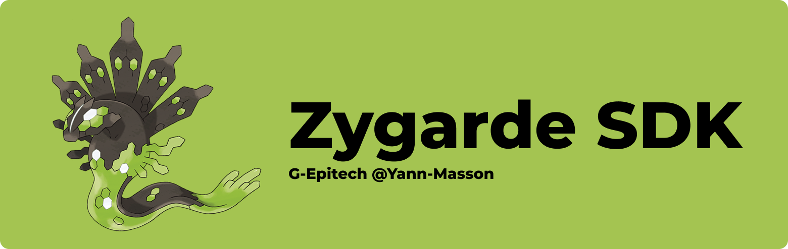

# 🧩 Zygarde SDK



The zygarde ECS SDK is a collection of tools with a useful API that allows you to create and manage entities, components, and systems.

## Usage

The registry is the main class of the zygarde ECS SDK. It is used to create entities, components, and systems.

:::info
The ECS SDK is available in the `zygrade` namespace.
:::

Let's see how to use the ECS SDK with a simple example.

First, include the necessary headers:

```cpp
#include <libs/zygrade/src/registry.hpp>
````

Then, we are going to declare some components in order to use them later:

```cpp
struct position {
  float x;
  float y;
};

struct velocity {
  float vx;
  float vy;
};

struct drawable {
  bool hidden;
};

struct controllable {
  bool up;
  bool down;
  bool left;
  bool right;
};
```

Now, we can Create a registry, register the components, and Create an entity:

```cpp
zygrade::registry registry;

registry.register_component<position>();
registry.register_component<velocity>();
registry.register_component<drawable>();
registry.register_component<controllable>();

auto entity = registry.SpawnEntity();
```

An entity was created, but it doesn't have any components yet. Let's add some components to the entity:

```cpp
registry.add_component<position>(entity, {10.0f, 20.0f});
registry.add_component<velocity>(entity, {1.0f, 2.0f});
registry.add_component<drawable>(entity, {false});
registry.add_component<controllable>(entity, {false, false, false, false});
```

Now, we can create a system that will display the position and velocity of the entity:

```cpp

class LoggingSystem final : public ASystem<position, velocity> {
 public:
  explicit LoggingSystem(const int nb) {
    std::cout << nb << std::endl;
  }

  void Run(Registry* r, sparse_array<position>& positions,
           sparse_array<velocity>& velocities) override {
    for (size_t i = 0; i < positions.size(); ++i) {
      const auto& [x, y] = positions[i].value();
      std::cout << i << ": Position = { " << x << ", " << y << " }" << std::endl;
    }
    const auto e = r->SpawnEntity();
    r->AddComponent(e, position{10.0f, 20.0f});
  }
};

```

Finally, we can run the system:

```cpp
registry.run_systems();
```

Here is the complete example:

```cpp
#include <iostream>
#include <libs/zygarde/src/registry.hpp>
#include <libs/zygarde/src/system_abstract.hpp>

struct position {
  float x;
  float y;
};

struct velocity {
  float vx;
  float vy;
};

struct drawable {
  bool hidden;
};

struct controllable {
  bool up;
  bool down;
  bool left;
  bool right;
};

class LoggingSystem final : public ASystem<position, velocity> {
 public:
  explicit LoggingSystem(const int nb) { std::cout << nb << std::endl; }

  void Run(Registry::Ptr r, sparse_array<position>::ptr positions,
           sparse_array<velocity>::ptr velocities) override {
    for (size_t i = 0; i < positions->size(); ++i) {
      const auto& [x, y] = (*positions)[i].value();
      std::cout << i << ": Position = { " << x << ", " << y << " }" << std::endl;
    }
    const auto e = r->SpawnEntity();
    r->AddComponent(e, position{10.0f, 20.0f});
  }
};

int main() {
  auto registry = zygarde::Registry::Create();

  registry->RegisterComponent<position>();
  registry->RegisterComponent<velocity>();
  registry->RegisterComponent<drawable>();
  registry->RegisterComponent<controllable>();

  const auto entity = registry->SpawnEntity();

  registry->AddComponent<position>(entity, {10.0f, 20.0f});
  registry->AddComponent<velocity>(entity, {1.0f, 2.0f});
  registry->AddComponent<drawable>(entity, {false});
  registry->AddComponent<controllable>(entity, {false, false, false, false});

  registry->AddSystem<LoggingSystem>(4);

  registry->RunSystems();

  return 0;
}
```
