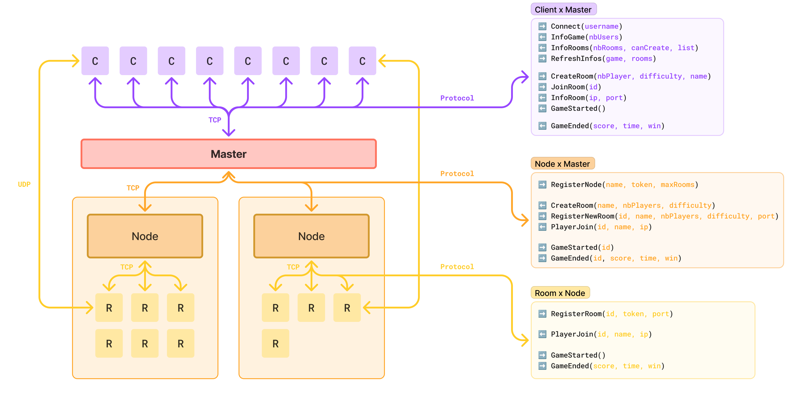

# R-Type protocol

## Architecture of the distributed infrastructure 🕸️

The R-Type is based on a big **distributed infrastructure** composed of a **master server** that will lead all actions,
a **node** that lead a server (machine), and **rooms** that are leaded by a node and can handle multiple clients.\
The **room** run the game logic and communicate with all the infrastructure to inform about player _join/leaving_ and _game status_.

Here is the composition of the infrastructure communication:\
Client ➡️ _**TCP**_ ⬅️ Master\
Master ➡️ _**TCP**_ ⬅️ Node\
Node ➡️ _**TCP**_ ⬅️ Room\
Room ➡️ _**UDP**_ ⬅️ Client
