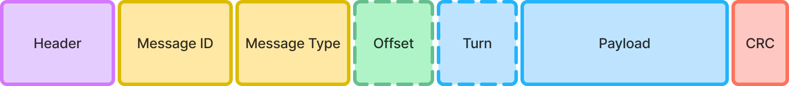
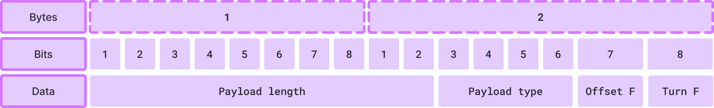
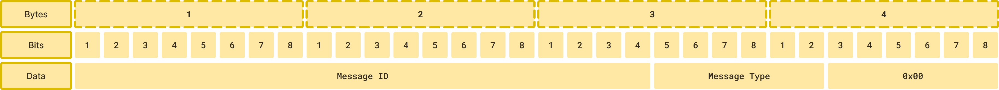
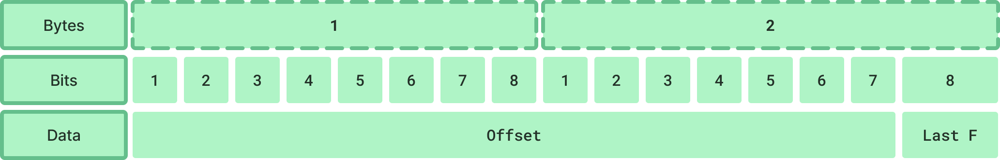
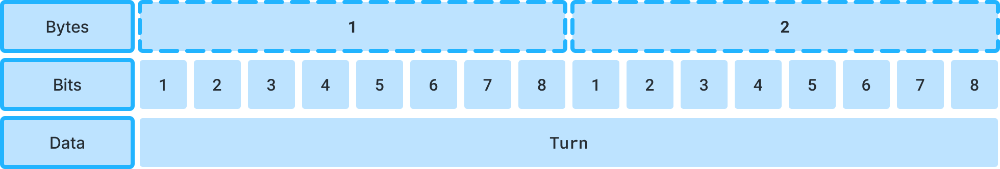

# Network protocol

## Architecture of a packet

A packet is composed as followed:

- Header ⇒ Informations about packet sizes and types
- Message ID ⇒ Potential humain readable message id
- Message Type ⇒ Related to the context of the message
- Offset ⇒ Optional offset in case of multi-packets
- Turn ⇒ Optional turn for packet status time management
- Payload ⇒ Data of the message
- CRC ⇒ Cyclic redundancy check to detect errors

## **Endianness**

Our binary protocol use big endian byte order, same as common network protocols.

See [network byte order by IMB](https://www.ibm.com/docs/en/zvm/7.3?topic=domains-network-byte-order-host-byte-order) for more informations.

## Header

The header is here to give useful informations about packet structuration such as payload type, offset infos etc…

| **Data** | **Bits allocated** | **Description** |
| --- | --- | --- |
| Payload length | 10 | Let payload size up to 1024 bytes |
| Payload type | 4 | Useful for auto conversions |
| Offset flag | 1 | High when the packet use multi packet system |
| Turn flag | 1 | Hight when the packet use turn system for status |

### Payload types

| Enum | Type | Bytes |
| --- | --- | --- |
| 0 | custom | n/a |
| 1 | Character | 1 |
| 2 | int8 | 1 |
| 3 | uint8 | 1 |
| 4 | int16 | 2 |
| 5 | uint16 | 2 |
| 6 | int32 | 4 |
| 7 | uint32 | 4 |
| 8 | float | 4 |
| 9 | double | 8 |

## Message ID

The message ID is use for two reason:

- Developer debug and infos
- Multi packet identification (Multiple packets can have the same ID with a different offset)

The message ID have `20 bits` allocated.

## Message Type

The message type is a enum number use to identify what type of message is send.

That allow you to prevent payload type in case of custom selection.

See all messages type here.

The message type have `6 bits` allocated.

A recap of messages bytes allocated:

## Offset

The offset is used in case of multi packet usage. It’s useful if you want to send a list of items.
Note that the message ID will be the same for all packets in the group.

The offset have `15 bits` allocated that allow you to send a maximum of `32768` elements.

The last byte is hight if the packet is the last in the list.

## Turn

The turn can be used when you want to send redundant data that is time dependant.

This turn allow you to set an turn to your packet to identify when a packet is out to date or not.

The turn have `16 bits` allocated. We recommend you to use a range variable to detect when you reset the turn to 0.

For exemple, `range = 60000`, if your last turn was `65300` and you get `65256`, the turn is lower and the difference between us is lower than the range.

However, in the case where you get `0`, the turn is lower but the difference is upper than the range which indicate that the turn loop restart, so it’s a packet to be taken into account.

## Payload

The payload is the content of your message, related to your Message Type.

The length of the payload is defined in the header. The payload can be custom or have a pre-defined type.

A payload can have a maximum of `1024 bytes` allocated.

## Cyclic redundancy check

Futur feature…